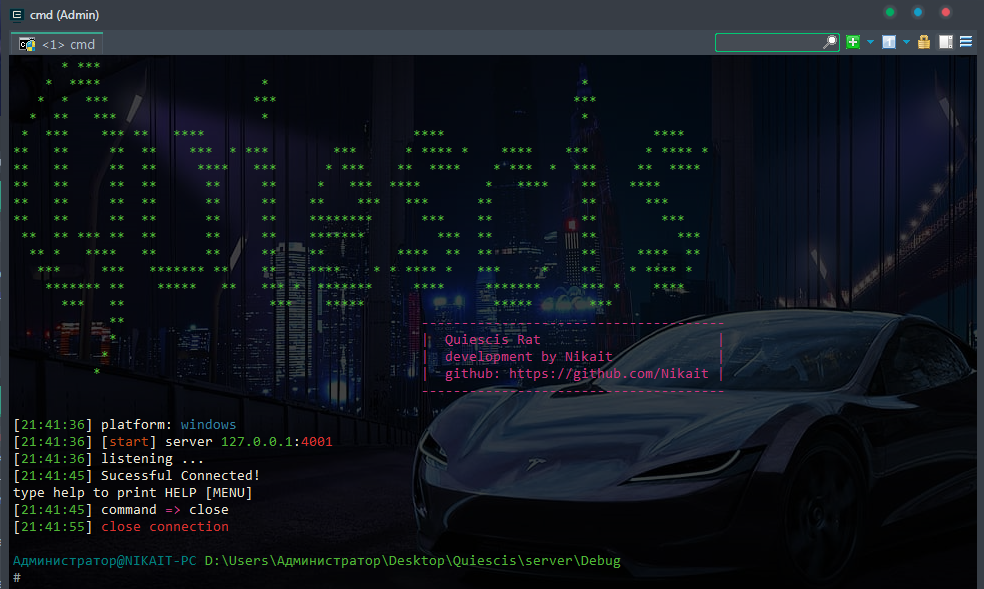
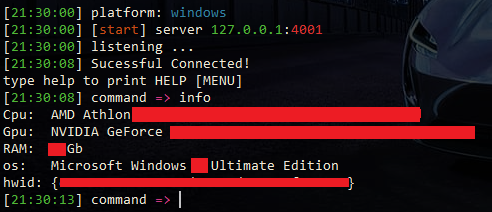
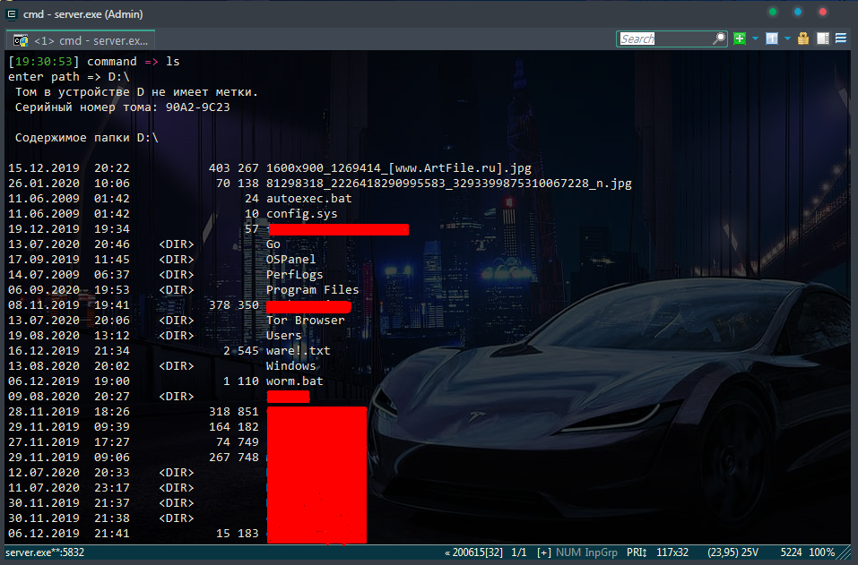
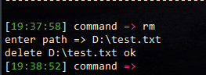
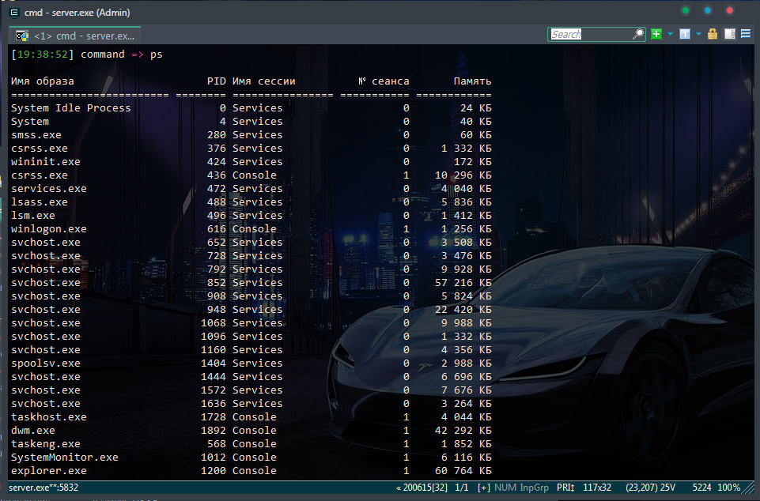
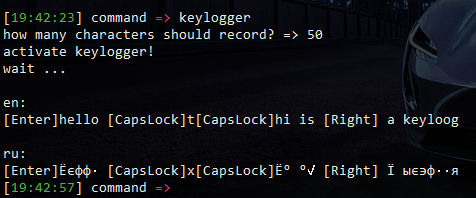
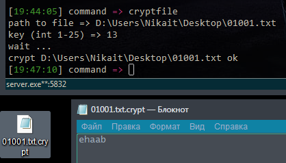
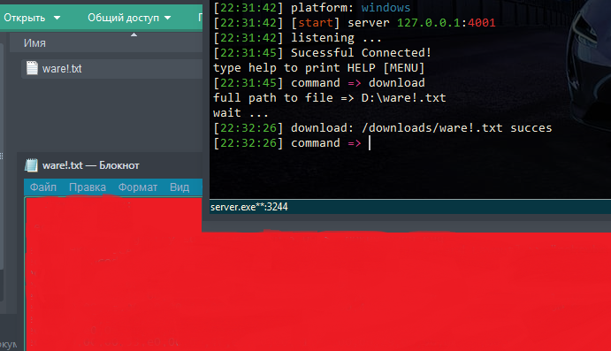
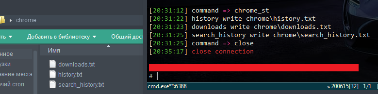
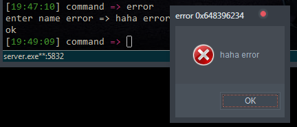

# Quiescis 1.2.6

<b>Quescis</b> is a powerful Remote Access Trojan for windows computer on C++

## Update 1.2.6
     1. Added to chrome_st the information about downloaded files and search requests
     2. Bugs fixed in Server.cpp

# Installing
## Server
    - Clone this repository 
    - Get a static ip or purchase VDS
    - Server Questions cross platform
      you can run it on linux distributions
      and windows

### <b>Linux distributions</b>: 
   - cd server/server
   - set Config.h, change PORT
   - g++ server.cpp -w
   - ./a.out
   
### <b>Windows</b>: 
   - cd server
   - open server.sln in Visual Studio
   - change PORT in Config.h
   - compile Ctrl + F5
   - server.exe in Debug/
   
## Client
    - Open in Visual Studio client/client.sln
    - Change IP and PORT in Config.h
    - Compile Ctrl + F5

# Features
- ⚙️ Autorun
- 📋 Information of system

- 🔭 Browse directories, delete files / folders

- ✔️ View all processes

- Ability to delete a process

- 🖋️ Real time keylogger

- 🔒 Encrypting files and directories

before:

after:

- 📲 download file

- 📲 chrome stealer
-    get history
-    get information about downloaded files
-    get search requests

- 🔌 Shutting down the operating system
- 😄 Throw Error MessageBox

# Commands
|   command   |                    description                 |
| ----------- |:-----------------------------------------------|
|     pwd     |  find out current directory                    |
|     ls      |  list files and dirs                           |
|  rm, rmdir  |  delete file; delete directory                 |
|    info     |  system information (cpu, gpu hardware id, os) |
|     ps      |  process info                                  |
|    kill     |  kill process                                  |
|  keylogger  |  start  keylogger (real time)                  |
|  cryptfile  |  encrypt file        with using XOR            |
|  cryptdir   |  encrypt directory   with using XOR            |
|  download   |  download file                                 |
|  chrome_st  |  chrome history stealer                        |
|  shutdown   |  shutting down                                 |
|   error     |  throw error MessageBox                        |

#  Donate
    monero: 
    48TmwHGVsqSKgD7giTALoK7P2muKLTJn5R8s5XtKZL1jEr4MJFBAwczVtofuFGvzsT1CzTcFXotwZCDno1UsskqFFZe9wVC

***
    bitcoin:
    18LKUKWAUBAFKzLBdFFkt687vh8rMPhL1u
***
    ethereum:
    0x189a9436b2fbBd0b1C3927E8a398379DBb7105AA
