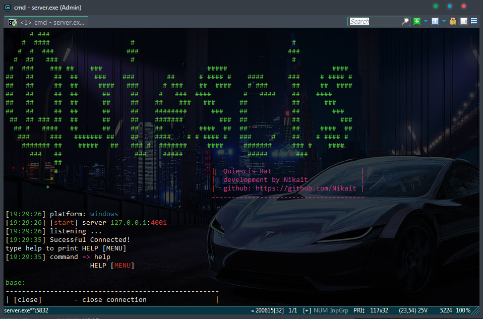

# Quiescis

<b>Questions</b> is a powerful Remote Access Trojan for windows computer on C++

# Installing
### Server
1. Clone this repository 
2. Get a static ip or purchase VDS
3. Server Questions cross platform
   you can run it on linux distributions
   and windows.

   
   
   Linux distributions:
   3.1 cd server/server 
   3.2 set Config.h, change PORT
   3.3 g++ server.cpp -w
   
